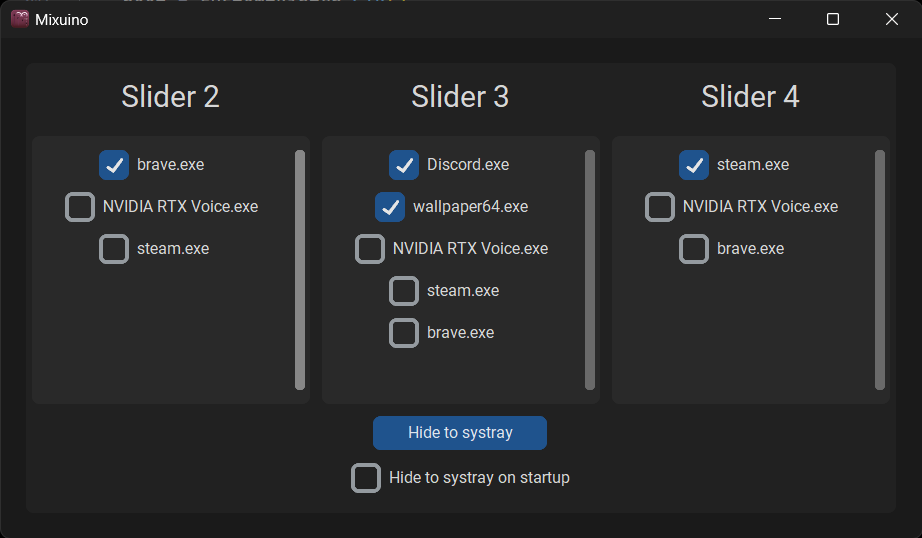

   

<p align="center">
  
</p>

<h1 align="center">Mixuino</h1>

<h3 align="center">An Arduino Mixer for windows built with Python</h3>


-----------

- Table of contents
	- Description
	- Built with
	- Usage
		- UI
		- Config file
	- Getting started
		- Software
			- Required libraries
			- Python
		- Hardware
			- Required hardware
			- Circuit diagram
	- Roadmap!
	- Contributing?
	- Contact
	- Acknowledgement/Credit


---------

Mixuino is a windows audio mixer build with on a Arduino nano and controlled by a python program. It uses 4 slide potentiometers feeding analog input into an Arduino nano that sends the values through serial to a python scripts that handles volume management in the windows machine. You can also add an optional push button to mute/un-mute the speakers. 

This is my first Arduino projects and first *"big"* program so please bear with me :)

-----
## Built with:

- 
- 
- 

---
## Usage 

### UI



Each option menu changes the process which each slider controls the volume of (1<sup>st</sup> slider is for master volume)

Hide to systray hides the window, the window can be revealed again from the systray icon option  ``Show`` 

There is also a checkbox than when checked changes the ``hideDefault`` value if you want the window to be hidden at startup

The options available refreshes and changes (if new programs are opened or others closed) when the mouse hovers any of the option menus

To close the application you can just close this window or close it with the ``Exit`` option in the systray icon

### Config file

To run the program you require [processes.yaml](processes.yaml) file with the structure : 
```yaml
hideDefault: false
slider1: ''
slider2: ''
slider3: ''

```
The values are the processes each slide changes and can be changed manually or through the UI

---
## Getting started

### Software

#### Required libraries:

##### Python
- Using pip

```python
comtypes==1.2.0 # To communicate with the ports

Pillow==10.1.0 # For opening the image for the systray icon

pycaw==20230407 # For audio handling

pyserial==3.5 # To read the serial data sent from the arduino

pystray==0.19.5 # To create and manage the systray icon

PyYAML==6.0.1 # To edit the Yaml config file

customtkinter==5.2.1 # To build the UI
```

```console
pip install comtypes

pip install Pillow

pip install pycaw

pip install pyserial

pip install pystray

pip install PyYAML

pip install customtkinter
```
##### Nothing needed for the Arduino

### Hardware 
#### Required hardware

- Arduino nano (you could use any Arduino tho)
- 4 (or more if you want to expand) slide potentiometers
- Optional push button for muting

##### Circuit diagram


---

## Roadmap!


- [ ] Slider 3D Models for 3D printing!
- [x] GUI to select which slides control which process (30/12/2023)

---
## Contributing?

- Feel free to open up any issues or ask for features in the issues tab!
- If you want to contribute directly make sure to fork the repo and submit a pull request for me to review.

---
## Contact

Feel free to contact me [@ThePangel_](https://twitter.com/thepangel_) on Twitter/X or DM me on discord @thepangel

----
## Acknowledgement/Credit

- Logo: Inés D'Olha

---
